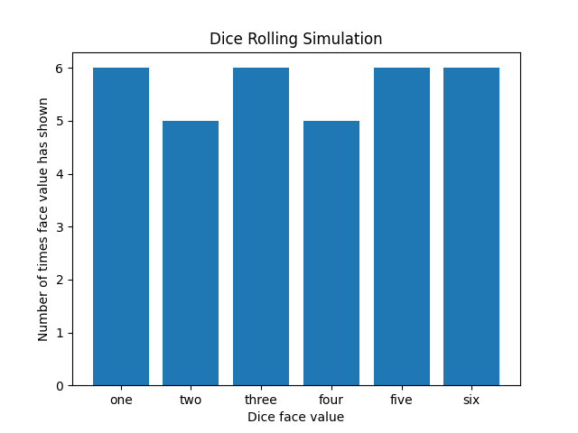

# Probabilty-Simulation
Probability simulations

Dice rolling simulator for a six sided dice.
Instructions for use:
1. Download and save both Python files in the one folder
2. Run dice_main.py
3. A command line prompt will require you to enter an integer greater than zero
4. The simulation will run and produce a graph of the results.

